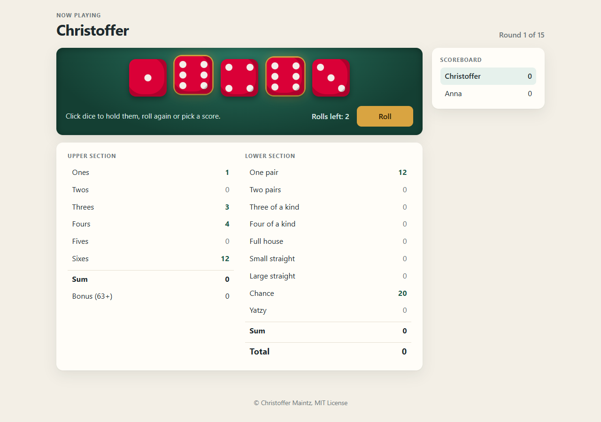

# YatzyWeb

[](https://github.com/CMaintz/yatzyweb/actions/workflows/ci.yml)

Yatzy in the browser. Add a few players in the lobby, then take turns at the same screen: roll up to three times, hold the dice you like, and pick a category on the score sheet. When everyone has filled all 15 categories you get a leaderboard.

I built it for the Distribueret Programmering course on the Datamatiker programme at Erhvervsakademi Aarhus. The game state lives on the server, Pug renders the pages, and the browser talks to a small JSON API for rolling, holding and scoring.



## Rules

Scandinavian Yatzy, not American Yahtzee:

- Upper section 1s to 6s, with a 50 point bonus once it reaches 63
- One pair, two pairs (must be two different pairs), three and four of a kind
- Full house is three of a kind plus a pair of a different value, scored as the sum of the dice
- Small straight is exactly 1-5 (15 points), large straight is exactly 2-6 (20 points)
- Chance is the sum of the dice, Yatzy is 50

You have to roll at least once before you can score or hold dice.

## Running it

Needs Node 22 or newer.

```sh
npm install
npm start
```

Then open http://localhost:8080. `PORT` and `SESSION_SECRET` can be set as environment variables. The secret falls back to a dev value, so set a real one if you put this anywhere public.

Each browser session gets its own game, kept in memory, so restarting the server clears all games.

## Tests

```sh
npm test          # node:test
npm run coverage  # same, with a coverage report
```

- `test/yahtzeeBrain.test.js` covers every scoring category plus edge cases (four of a kind isn't two pairs, Yatzy isn't a full house, unrolled dice score 0)
- `test/player.test.js` covers the upper section bonus and that a category can only be used once
- `test/routes.test.js` uses supertest against the Express app: separate games per session, input validation on every route, the three-roll limit, holding dice, and a full two-player game through to the leaderboard

CI runs the tests on Node 22 and 24.

## Structure

```
app.js              Express routes and the per-session game store
backend/            GameState, Player, Dice and YahtzeeBrain (scoring)
views/              Pug templates for lobby, game and end screen
assets/             Client JS, CSS and dice images
test/               node:test suites
```

## License

MIT
